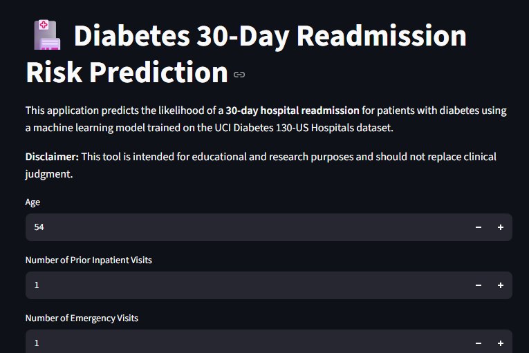
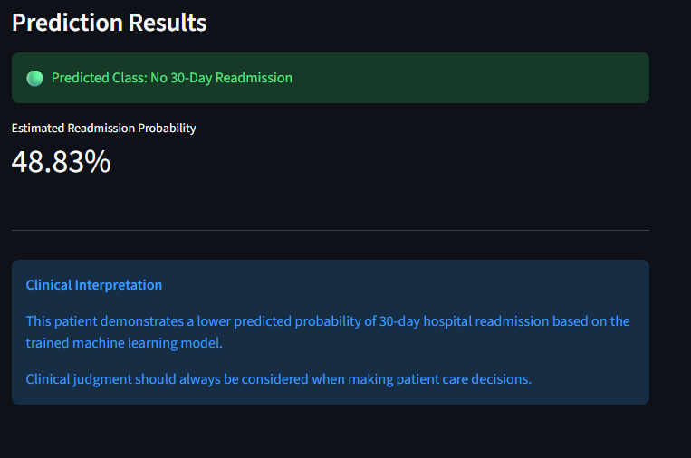

# Diabetes 30-Day Readmission Risk Prediction

Machine learning pipeline to predict 30-day hospital readmission risk among patients with diabetes using clinical and healthcare utilization data.

Live Streamlit Application:
https://diabetes-readmission-prediction-x7rqhrfmcyz3r2t88rkhzz.streamlit.app/

Tableau Public link:
https://public.tableau.com/views/Diabetes_Readmission_Risk_Dashboard/DiabetesReadmissionRiskDashboard?:language=en-US&:sid=&:redirect=auth&:display_count=n&:origin=viz_share_link
## Project Overview

This project develops a machine learning pipeline to identify factors associated with 30-day hospital readmission among diabetic inpatient encounters with emergency admission.

## Study Objective

The objective of this study was to identify demographic, clinical, and healthcare utilization factors associated with 30-day readmission among diabetic inpatient encounters with emergency admission and develop a machine-learning-ready dataset for predictive modeling.

The goal was to analyze demographic, clinical, and healthcare utilization characteristics associated with readmission risk and construct a machine-learning-ready dataset for predictive modeling.

## Research Question

Which demographic, clinical, and healthcare utilization factors are associated with 30-day hospital readmission among diabetic inpatient encounters with emergency admission?

## Supporting Questions

1. What patient and hospitalization characteristics are associated with increased readmission risk?

2. How does prior healthcare utilization (previous inpatient and emergency visits) relate to 30-day readmission?

3. Which clinical features contribute most to predicting readmission risk?

4. How well do different machine learning models perform in identifying high-risk patients?

## Dataset

Dataset:
UCI Diabetes 130-US Hospitals for Years 1999-2008

The dataset contains hospital encounters for patients with diabetes and includes:

* Demographic information
* Laboratory measurements
* Medication information
* Healthcare utilization variables
* Admission characteristics
* Prediction Target

## Clinical Cohort Definition

The study population consisted of diabetic inpatient encounters admitted through the emergency department.

Patients were identified using ICD-9 diabetes diagnosis codes beginning with "250%" and filtered to emergency admission encounters.

### Outcome	Definition
- 1	Readmitted within 30 days
- 0	Not readmitted within 30 days

## Machine Learning Workflow

The project followed an end-to-end clinical machine learning workflow:

1. Data extraction and cleaning
2. Missing value and data quality assessment
3. Exploratory data analysis
4. Feature engineering
5. Train/test split
6. Model development
7. Model evaluation
8. Clinical interpretation
9. Streamlit deployment
10. Feature Engineering

Final model features included:

### Patient Characteristics
* Age
  
### Healthcare Utilization

* Prior inpatient visits
* Emergency visits
* Length of hospital stay
  
### Clinical Indicators

* A1C results
* Maximum glucose serum
* Insulin treatment
* Medication changes

Categorical variables were transformed using one-hot encoding before model training.

## Final Model Performance

Logistic Regression was selected as the final model because it had the strongest ROC-AUC and provided interpretable risk estimates.

| Metric | Result |
|---|---:|
| Accuracy | 69.8% |
| Precision | 18.9% |
| Recall | 50.4% |
| F1 Score | 0.275 |
| ROC-AUC | 0.672 |

Because 30-day readmissions were relatively uncommon, accuracy was interpreted alongside recall, precision, F1 score, and ROC-AUC. The model identified approximately half of readmissions, but its positive predictions had limited precision.

## Streamlit Deployment

The trained model was deployed as an interactive Streamlit application.

Users can enter patient characteristics including:

* Age
* Prior inpatient visits
* Emergency visits
* Hospital stay duration
* A1C status
* Glucose measurement
* Insulin treatment
* Medication changes

The application provides:

* Predicted readmission class
* Estimated probability of 30-day readmission

## Modeling Limitations

The dataset exhibited class imbalance, as patients readmitted within 30 days represented a smaller proportion of encounters. This imbalance may have affected the model’s ability to identify readmissions accurately.

Model performance may improve through hyperparameter tuning, threshold adjustment, cross-validation, and additional imbalance-handling techniques.

The dataset represents historical hospital encounters from 1999–2008 and may not reflect current healthcare practices. External validation using an independent healthcare dataset would be necessary before any clinical deployment.

This model is intended for educational and research purposes and should support—not replace—clinical judgment.

## Future Improvements

Future work could evaluate additional feature-engineering approaches, optimize model hyperparameters, tune the decision threshold, assess calibration, and validate the model using an independent healthcare dataset.
## Technologies Used

* Python
* Pandas
* NumPy
* Scikit-learn
* SQL
* Jupyter Notebook
* Streamlit
* GitHub
  
## Conclusion
Logistic Regression was selected as the final model because it achieved the highest ROC-AUC (0.672) while remaining interpretable. The model showed moderate ability to distinguish 30-day readmissions from non-readmissions.

Because readmission was the minority outcome and positive-class precision was low, this project should be interpreted as an educational risk-screening example rather than a clinical decision-making tool.

## Repository Structure

├── app.py
├── Diabetes_Readmission_Project.ipynb
├── diabetes_readmission_model.pkl
├── model_features.pkl
├── diabetes_final_ml_dataset.csv
├── requirements.txt
├── images/
└── README.md

## Streamlit Application

The final machine learning model was deployed as an interactive Streamlit application.

### Prediction Interface

### Prediction Output

## Tableau Dashboard

Interactive dashboard exploring clinical and healthcare utilization factors associated with 30-day diabetes readmission risk.

Key areas:
- A1C categories
- Maximum serum glucose
- Prior inpatient visits
- Hospital length of stay
- Medication changes

