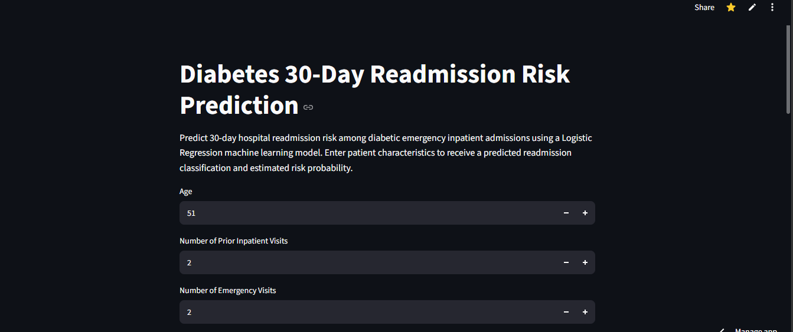
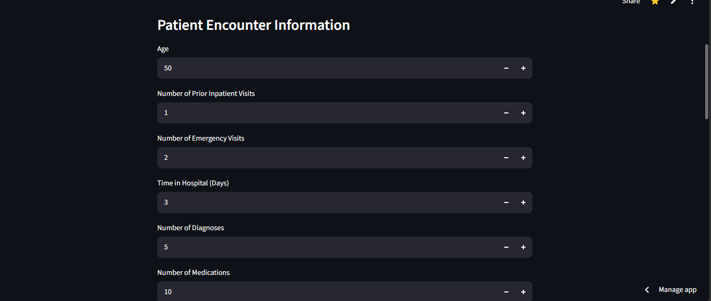
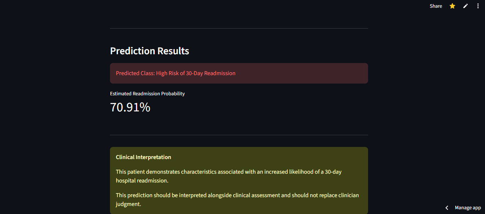
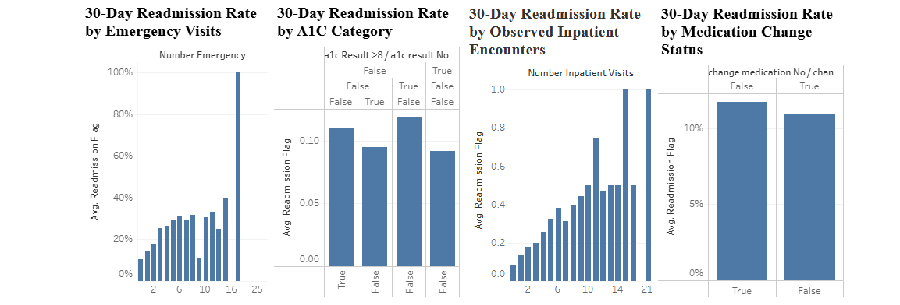
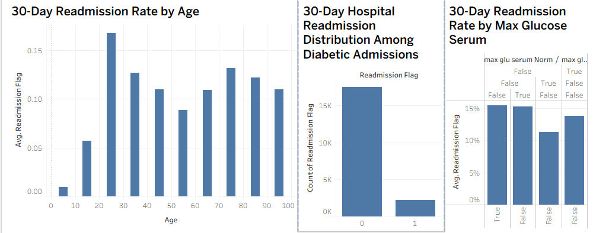

## Predicting 30-Day Hospital Readmission Risk Among Diabetic Emergency Inpatient Admissions Using Machine Learning

Live Streamlit Application:https://diabetes-readmission-prediction-x7rqhrfmcyz3r2t88rkhzz.streamlit.app/

Tableau Public link:
https://public.tableau.com/views/Diabetes_Readmission_Risk_Dashboard/DiabetesReadmissionRiskDashboard?:language=en-US&:sid=&:redirect=auth&:display_count=n&:origin=viz_share_link

## Project Article

For a detailed walkthrough of the project, including the clinical problem, data preparation, exploratory analysis, machine learning models, evaluation, and deployment:

**[Read the Full Project Walkthrough on Medium](https://medium.com/@davontacarruth/building-a-machine-learning-model-to-predict-30-day-hospital-readmissions-for-patients-with-83f11cbb3ab9)**

## Clinical Problem

Hospital readmissions within 30 days are an important healthcare challenge because they may indicate opportunities to improve care coordination, medication management, patient education, and chronic disease management. Patients with diabetes may be at increased risk of complications that can lead to repeated hospital encounters.

This project focuses on identifying diabetic inpatient encounters at higher risk of 30-day readmission using demographic, clinical, and healthcare utilization data.

## Business Problem

Healthcare organizations need analytical tools that can help identify patients at higher risk so care teams can prioritize follow-up and care management efforts.

This project demonstrates how healthcare data and machine learning can be used to predict readmission risk and identify factors associated with higher predicted risk, supporting population health and clinical analytics use cases.

## Study Objective

To identify demographic, clinical, and healthcare utilization factors associated with 30-day hospital readmission among diabetic emergency inpatient admissions and construct a machine-learning-ready dataset for predictive modeling

## Research Question

Which demographic, clinical, and healthcare utilization factors are associated with 30-day hospital readmission among diabetic emergency inpatient admissions?

## Dataset

Dataset:
UCI Diabetes 130-US Hospitals for Years 1999-2008

## Tools Used

- Python
- SQL Server
- SQL
- Pandas
- NumPy
- Scikit-learn
- Jupyter Notebook
- VS Code
- Tableau Public
- Streamlit
- GitHub

The dataset contains hospital encounters for patients with diabetes and includes:

* Demographic information
* Laboratory measurements
* Medication information
* Healthcare utilization variables
* Admission characteristics
* Prediction Target

## Clinical Cohort Definition

The study population consisted of diabetic inpatient encounters admitted through the emergency department.

Patients were identified using ICD-9 diabetes diagnosis codes beginning with "250%" and filtered to emergency admission encounters.

### Outcome	Definition
- 1	Readmitted within 30 days
- 0	Not readmitted within 30 days

# Project Workflow

This project follows an end-to-end clinical data science workflow:

1. Connect to SQL Server
2. Perform data quality checks and validation
3. Clean and standardize the data
4. Extract the diabetes patient cohort
5. Perform exploratory data analysis (EDA)
6. Analyze factors associated with readmission risk
7. Engineer features for machine learning
8. Split data into training and testing sets
9. Build and evaluate predictive models
10. Interpret model results and summarize findings
11. Deploy the model using Streamlit
    
Final model features included:

### Patient Characteristics
* Age

### Healthcare Utilization

* Number of inpatient visits
* Emergency visits
* Length of hospital stay
  
### Clinical Indicators

* A1C results
* Maximum glucose serum
* Insulin treatment
* Medication changes

Categorical variables were transformed using one-hot encoding before model training.

## Final Model Performance

Logistic Regression was selected as the final model because it had the strongest ROC-AUC and provided interpretable risk estimates.

| Metric | Result |
|---|---:|
| Accuracy | 69.8% |
| Precision | 18.9% |
| Recall | 50.9% |
| F1 Score | 0.275 |
| ROC-AUC | 0.672 |

Because 30-day readmissions were relatively uncommon, accuracy was interpreted alongside recall, precision, F1 score, and ROC-AUC. The model identified approximately half of readmissions, but its positive predictions had limited precision.

## Key Findings

Exploratory analysis identified healthcare utilization as the strongest signal associated with 30-day readmission risk.

Key findings:

- Patients with 30-day readmission had higher healthcare utilization compared with non-readmitted encounters.
- Readmitted encounters averaged 2.81 hospital encounters compared with 1.51 among non-readmitted encounters.
- Demographic factors showed smaller differences compared with utilization-related variables.
- Logistic Regression provided the best balance between interpretability and minority-class detection.
  
## Streamlit Deployment

The trained model was deployed as an interactive Streamlit application.

Users can enter patient characteristics including:

* Age
* Prior inpatient visits
* Emergency visits
* Hospital stay duration
* A1C status
* Glucose measurement
* Insulin treatment
* Medication changes

The application provides:

* Predicted readmission class
* Estimated probability of 30-day readmission

## Modeling Limitations

The dataset exhibited class imbalance, as patients readmitted within 30 days represented a smaller proportion of encounters. This imbalance may have affected the model’s ability to identify readmissions accurately.

Model performance may improve through hyperparameter tuning, threshold adjustment, cross-validation, and additional imbalance-handling techniques.

The dataset represents historical hospital encounters from 1999–2008 and may not reflect current healthcare practices. External validation using an independent healthcare dataset would be necessary before any clinical deployment.

This model is intended for educational and research purposes and should support—not replace—clinical judgment.

## Future Improvements

Future work could evaluate additional feature-engineering approaches, optimize model hyperparameters, tune the decision threshold, assess calibration, and validate the model using an independent healthcare dataset.

## Conclusion

Logistic Regression was selected as the final model because it achieved the highest ROC-AUC (0.672) and recall (50.9%) while remaining interpretable The model showed moderate ability to distinguish 30-day readmissions from non-readmissions.

Because readmission was the minority outcome and positive-class precision was low, this project should be interpreted as an educational risk-screening example rather than a clinical decision-making tool.

## Repository Structure

Diabetes-Readmission-Prediction/

├── .devcontainer/
│   └── devcontainer.json
│
├── images/
│   ├── streamlit_overview_1.png
│   ├── streamlit_overview_2.png
│   ├── streamlit_prediction_3.png
│   ├── tableau_dashboard_1.png
│   └── tableau_dashboard_2.png
│
├── README.md
│
├── app.py
│
├── diabetes_final_ml_dataset.xls
│
├── diabetes_readmission_data_preprocessing_documentation.xlsx
│
├── diabetes_readmission_model.pkl
│
├── diabetes_readmission_project.ipynb
│
├── diabetes_readmission_risk_dashboard.twbx
│
├── diabetes_readmission_risk_prediction_presentation.pptx
│
├── model_features.pkl
│
└── requirements.txt

The final machine learning model was deployed as an interactive Streamlit application.

## Streamlit Application

## Tableau Dashboard

Interactive dashboard exploring clinical and healthcare utilization factors associated with 30-day diabetes readmission risk.

Key areas:

- A1C categories
- Maximum serum glucose
- Prior inpatient visits
- Hospital length of stay
- Medication changes

### Tableau Dashboard

